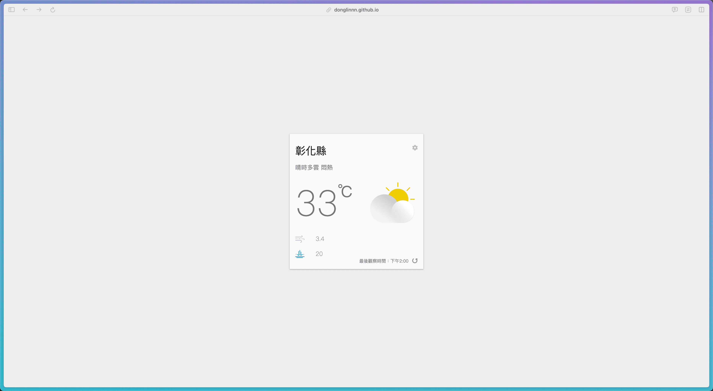
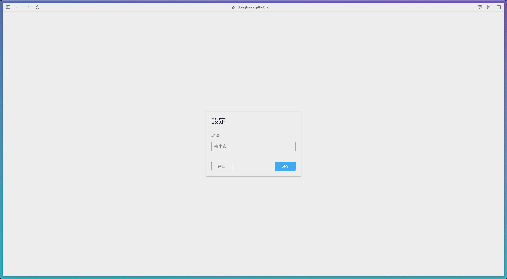
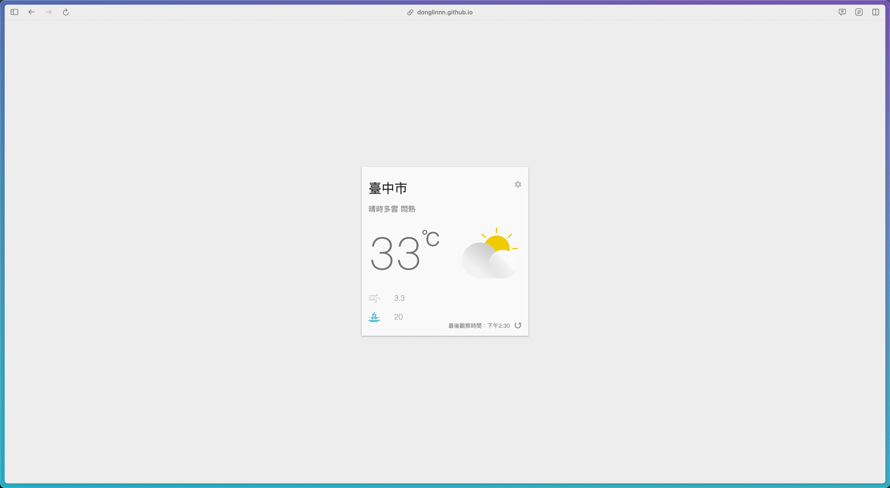

# 臺灣各地天氣－即時縣市天氣專案介紹

### 此專案GitHub Pages網址： https://donglinnn.github.io/react-learning-realtime-weather-app/

## 專案Demo:

##### 一進到頁面後，即可看見天氣卡的畫面，顯示天氣狀況、舒適度、溫度、風速及降雨機率等資訊，且會根據當下時刻切換亮色或暗色的顯示主題。預設是顯示當下臺北市的天氣資訊，若使用者曾經有進入過此網頁並改變顯示天氣的地區，則會被存入localStorage中，之後進入網頁就是顯示之前設定地區的天氣。

##### 按下右下角的重新整理按鈕，即可刷新當下的天氣資訊。 按下右上角的齒輪按鈕後，即可進入此專案的第二個畫面，在此畫面中，有選單可以選擇全臺灣各縣市。

##### 按下儲存後，即可更新為顯示指定縣市的天氣資訊。

### 此專案中學習到的新技術：
1. 使用emotion的styled套件進行CSS-in-JS的樣式設定。
2. 運用4個React Hooks在此專案中;使用useState和useEffect更新狀態及畫面，並使用useCallback及useMemo進行效能優化，避免儲存多次相同函式內容在不同記憶體以及不必要的畫面刷新。
3. 抓取2支中央氣象局的API進行資料分析，找出想要的資訊。
4. 將所有有關抓取API的函式整合到一個自訂的React Hook (useWeatherAPI)。
